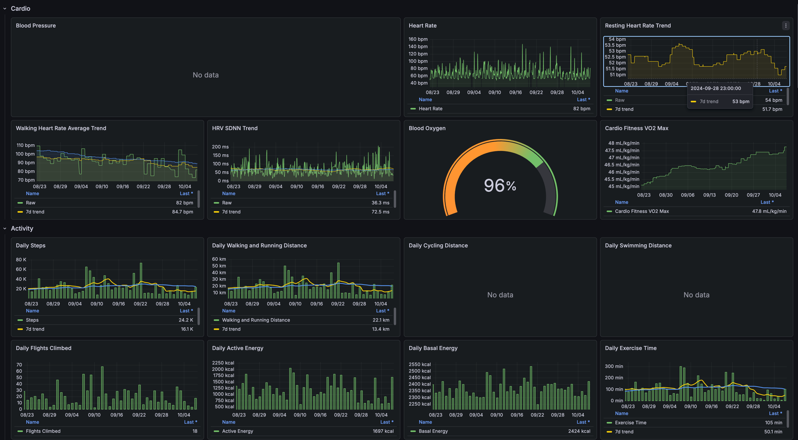

# Apple Health Export



Sync Apple Health data from your iPhone to a local Grafana dashboard.

The project runs a local Docker stack on your Mac:

- Rust gRPC gateway on port `50051`
- Victoria Metrics on port `8428`
- Grafana on port `3000`

The iOS app reads HealthKit samples, sends them to the gateway over your local Wi-Fi network, and uses checkpoints so later syncs only send new data.

## Requirements

- macOS with Docker Desktop
- Xcode 16 or newer
- iPhone running iOS 18 or newer
- iPhone and Mac on the same Wi-Fi network
- Homebrew, used by `ios-app/setup.sh` to install XcodeGen if needed
- Apple Developer Program membership for real HealthKit data

You can still test the full pipeline with demo data if HealthKit is not available or authorization is denied.

## Quick Start

### 1. Start the Local Stack

```bash
git clone https://github.com/babanin/apple-health-export
cd apple-health-export
./scripts/start.sh
```

The script pulls the pre-built gateway image (Rust, ~25 MB) from GitHub Container Registry and starts Docker Compose. It prints the settings to enter in the iPhone app, for example:

```text
Grafana:
  URL:      http://localhost:3000
  Login:    admin / admin

iPhone app Server settings:
  Host:     192.168.1.25
  Port:     50051
  Address:  192.168.1.25:50051
```

Grafana is provisioned automatically with the Victoria Metrics datasource and the Apple Health dashboards.

You can also start the stack through `make`:

```bash
make start
```

### 2. Build the iPhone App

```bash
cd ios-app
./setup.sh
open HealthExporter.xcodeproj
```

In Xcode:

1. Select the `HealthExporter` target.
2. Open **Signing & Capabilities**.
3. Select your Apple developer team.
4. Change the bundle identifier if Xcode reports that it is already taken.
5. Connect your iPhone and run the app.

For real HealthKit data, make sure the HealthKit capability is present in **Signing & Capabilities**. The project already includes the HealthKit usage descriptions and entitlement.

### 3. Connect and Sync

In the iPhone app:

1. Enter the host and port printed by `./scripts/start.sh` in **Server**.
2. Do not use `localhost` on the phone; it points at the phone, not your Mac.
3. Tap **Ping**.
4. Tap **Authorize Health Access** and allow the categories you want to export.
5. Tap **Sync Now**.

Then open Grafana at `http://localhost:3000` and use the dashboards in the `Apple Health` folder.

## Troubleshooting

**Ping fails from the iPhone**

- Confirm the Mac and iPhone are on the same Wi-Fi network.
- Use the Mac LAN IP address, not `localhost`.
- Allow incoming connections if macOS Firewall prompts you.
- Check that the gateway is running:

```bash
docker compose ps
docker compose logs -f gateway
```

**Grafana is empty**

- Run a sync from the iPhone app first.
- Check the app log panel for rejected Health permissions or gateway errors.
- In Grafana, widen the time range to `Last 30 days` or `Last 1 year`.

**Blood pressure is empty**

Hard rule: never add `HKCorrelationTypeIdentifierBloodPressure` to the HealthKit authorization read set. This has already caused the app to crash more than once with:

```text
NSInvalidArgumentException: Authorization to read the following types is disallowed: HKCorrelationTypeIdentifierBloodPressure
```

Blood pressure is exported as two Victoria Metrics series:

- `apple_health_blood_pressure_systolic_mmhg`
- `apple_health_blood_pressure_diastolic_mmhg`

HealthKit stores blood pressure as systolic and diastolic quantity samples that may also appear inside a `HKCorrelationTypeIdentifierBloodPressure` correlation. The app requests read access only to the systolic and diastolic quantity types, then exports each component as its own metric. Grafana panels forward-fill the latest value over the dashboard range with `last_over_time(...[$__range])` and `spanNulls`, because blood pressure is usually sparse.

Manual and in-app automatic syncs refresh HealthKit authorization before reading real data. This matters after app updates that add a new HealthKit type: iOS may have granted older metrics already, but the app still needs to ask again for the systolic and diastolic quantity permissions.

Known investigation result: if blood pressure is missing while other metrics sync, do not start by changing Grafana queries again. The dashboard queries already use the expected metric names and forward-fill behavior. In the May 2026 investigation, Victoria Metrics returned no `apple_health_blood_pressure_*` series and gateway logs showed `blood_pressure_counts systolic=0 diastolic=0` for synced batches, so the failure was upstream of Grafana: the iPhone was not exporting BP samples.

The iPhone app keeps only the latest 500 in-memory log entries. Full historical syncs can push early per-metric blood-pressure fetch logs out of the UI before the sync finishes, so the app also writes this end-of-sync line:

```text
Blood pressure diagnostic: fetched systolic=<count>, diastolic=<count>; <errors or no fetch errors>
```

If the panel is still empty, check whether the gateway has received BP samples:

```bash
docker compose logs gateway | rg blood_pressure_counts
curl 'http://127.0.0.1:8428/api/v1/query?query=count_over_time(apple_health_blood_pressure_systolic_mmhg[10y])'
curl 'http://127.0.0.1:8428/api/v1/query?query=count_over_time(apple_health_blood_pressure_diastolic_mmhg[10y])'
```

Use `count_over_time`, not instant `count(...)`, for BP diagnostics. Blood pressure is sparse; if the latest BP sample is older than the instant-query lookback window, `count(metric)` can return an empty result even when Victoria Metrics has historical BP samples. If `count_over_time(...[10y])` returns samples but Grafana is empty, widen the dashboard time range so it includes the latest BP sample and keep the `source` variable on `All` or `Health`.

**HealthKit data does not appear**

- Real HealthKit export requires a physical iPhone.
- Health permissions are per metric; review access in the Apple Health app or iOS Settings.
- If HealthKit is unavailable or denied, the app switches to demo data so you can still validate the backend.

**You changed dashboards but Grafana did not update**

Grafana only reloads provisioned dashboards on startup:

```bash
make dashboards
docker compose restart grafana
```

## Useful Commands

```bash
# Start or rebuild the stack
make start

# Follow gateway logs
make docker-logs

# Stop and remove stack volumes
make docker-down

# Regenerate curated Grafana dashboards
make dashboards

# Regenerate Swift protobuf stubs
make proto-swift

# Run Rust unit tests
make test-rs

# Run Rust lints
make lint-rs
```

## What Gets Exported

The app exports HealthKit quantity and category metrics using Prometheus-style names with the `apple_health_` prefix, for example:

- `apple_health_heart_rate_bpm`
- `apple_health_steps_total`
- `apple_health_sleep_stage`
- `apple_health_vo2_max_ml_kg_min`
- `apple_health_blood_glucose_mg_dl`

See [`HKMetricMapping.swift`](ios-app/HealthExporter/Models/HKMetricMapping.swift) for the full mapping.

## Architecture

```text
iPhone HealthKit
  -> HealthKitManager fetches samples
  -> iOS app sends gRPC batches over Wi-Fi
  -> Rust gateway receives SyncMetrics requests (tonic)
  -> gateway writes NDJSON samples to Victoria Metrics
  -> Grafana reads Victoria Metrics dashboards
```

Checkpoints are stored on both sides:

- iPhone: `UserDefaults`
- gateway: SQLite in the Docker volume mounted at `/data/checkpoints.db`

On each sync, the app sends its last known per-metric timestamps. The gateway merges them with server-side checkpoints and returns the latest values, so future syncs can skip previously exported samples.

## Project Layout

```text
apple-health-export/
├── docker-compose.yml
├── Dockerfile.rust
├── Makefile
├── proto/
│   └── health_export.proto
├── gateway-rs/
│   ├── Cargo.toml
│   ├── build.rs
│   └── src/
│       ├── main.rs
│       ├── server.rs
│       ├── vm_writer.rs
│       └── checkpoint.rs
├── ios-app/
│   ├── setup.sh
│   ├── project.yml
│   └── HealthExporter/
├── scripts/
│   └── generate_dashboards.py
├── dashboards/
└── grafana/provisioning/
```

## Development Notes

- Generated Swift files live in `ios-app/HealthExporter/Generated/`; regenerate them with `make proto-swift`.
- Curated dashboard JSON is generated by `scripts/generate_dashboards.py`; run `make dashboards` after changing it.
- The provisioned Victoria Metrics datasource UID must stay `victoriametrics` because the dashboards reference that UID directly.
- After Swift changes, regenerate and build the Xcode project:

```bash
cd ios-app
xcodegen generate
xcodebuild -scheme HealthExporter -sdk iphonesimulator -destination 'platform=iOS Simulator,name=iPhone 17,OS=latest' build
```
